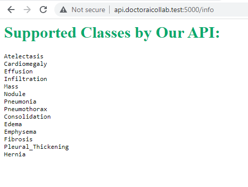
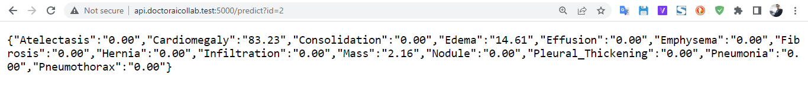

# Flask FirstApp

## About

This is the deployment of the Deep Learning model which I use alongside with my laravel
web-app [**DoctorAICollab Github Repo**](https.//github.com/whbb98/laravel-firstApp) to send the predictions
for the existing blog images in our database.

---
## Screenshots

---

